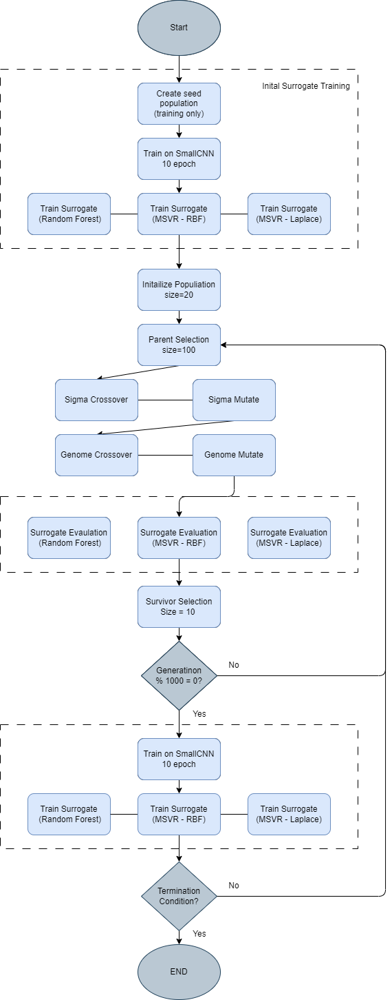

# SAEA-CNN-Optimization

Surrogate Assisted Evolutionary Algorithm (SAEA) for CNN Hyperparameter Optimization

## Directory Listing

| File Name      | Description                                                   |
| -------------- | ------------------------------------------------------------- |
| saea_cnn.ipynb | primary notebook to execute SAEA evolution                    |
| ea_cnn.ipynb   | runs the control group EA (with surrogate functions)          |
| results.ipynb  | code for all results plots                                   |
| util.py        | CNN model and utility functions                               |
| es.py          | Genome model, EA fitness functions, variation operations, etc |
| surrogates.py  | surrogate models used to approximate the EA fitness functions |

## Abstract

The performance of convolutional neural networks
(CNNs) depends on the choice of hyperparameters, which can be
challenging to determine manually. One approach to optimizing
a CNN is to use evolutionary algorithms which involves creating
a population of hyperparameter candidates, evaluating their
performance by training the CNN using those parameters,
and selecting the top-performing individuals to create the next
generation through genetic operations of mutation and crossover.
While this approach can reach good solutions much quicker than
others such as exhaustive grid search, it is still computationally
expensive to train the CNN necessary for fitness evaluations.
This paper investigates the use of surrogate assisted evolutionary
algorithms to optimize the CNN’s SGD optimizer parameters of
learning rate, momentum, and weight decay. We use three surrogate models, a random forest regressor, a multiple-output support
vector regressor (MSVR) with a RBF kernel, and a MSVR with
a Laplacian kernel to quickly approximate fitness functions in
place of full CNN training. Our results (1) demonstrate clear
evolutionary learning showing promise for evolutionary strategies
to optimize real-world CNNs; (2) show surrogate models are
able to reach good solutions much quicker than evaluations on
the full CNN ( 42.6 minutes); (3) indicate that while surrogate
models reach good solutions much quicker, fitness evaluations
performed on the full model eventually produced more optimal
results. Our research provides a reference point for others to
apply evolutionary algorithms to hyperparameter optimization
and demonstrates the application of surrogate models to assist
in the evaluation of computationally expensive fitness functions.
Keywords— evolutionary strategies surrogate CNN hyperparameter optimization

## Overview of SAEA Process

